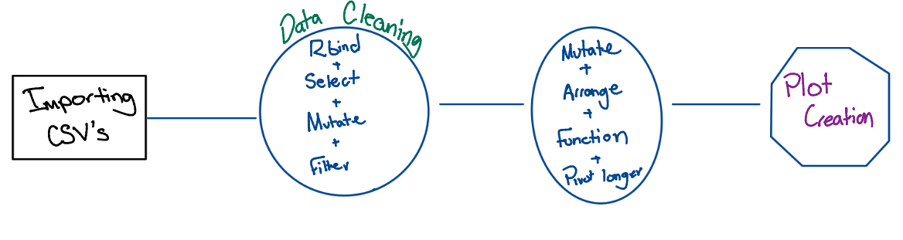

# Water Quality Hurricane Disturbance in Puerto Rico Concentrations

#### Hurricane Hugo affects during 1989-1999, focused on chemical balances

The goal of this repository is to recreate the image from the original report figure 3, 'Concentrations in Bisley, Puerto Rico streams before and after Hurricane Hugo, 9-wk moving averages. (a) potassium, (b) nitrate-N, (c) magnesium, (d) calcium and (e) ammonium-N. The vertical lines mark the time of hurricane disturbance.' Schaefer D report.

Here you can find a guide on how the information was gathered, uploaded, tidy wrangled, and create a reproducible code to try other methods.

# 1. Data

The data was read into R studio, where the data was downloaded using the EDI repository. [<https://portal.edirepository.org/nis/mapbrowse?packageid=knb-lter-luq.20.4923064>].

**Citation** for this paper is Schaefer DouglasA, McDowell WH, Scatena FN, Asbury CE. Effects of hurricane disturbance on stream water concentrations and fluxes in eight tropical forest watersheds of the Luquillo Experimental Forest, Puerto Rico. Journal of Tropical Ecology. 2000;16(2):189-207. <doi:10.1017/S0266467400001358>.

**Author**: Marie Tolteca (Github = marietolteca00, Email: [marietolteca\@ucsb.edu](mailto:marietolteca@ucsb.edu){.email}), University Stanta Barbara, Bren School of Environmental Data Science, Student Cohort 2025-2026.

# Analysis

To load in the data I uploaded the csv's I was interested in and to find the script on how it can be found in the intermediate results folder, use 'data_cleaning.R' and 'data_import.R'. After completing these steps I created a function saved under the R folder, called ' Rolling_average.R'. This was used in the the data_cleaning script. All the outputs can be found in the 'outputs' folder.

Once, this was all ran correctly, a plot was created to mirror the figure 3 in the research paper.
